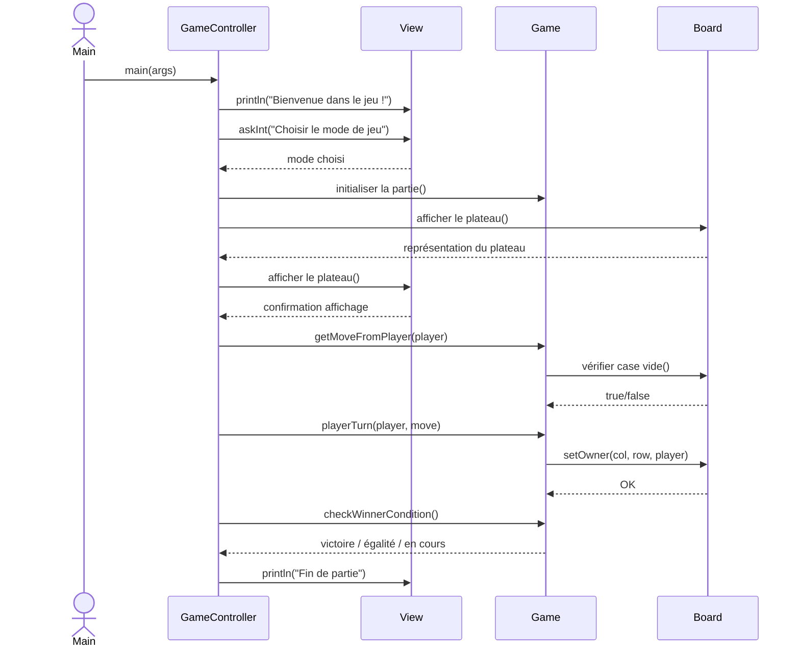

# SquareGames

School project in Java

---

## Description
This project aims to create a TicTacToe game or a Gomoku game, or a Connect4 game, playable in console.

The first menu allows the user to choose the type of game he wants to play, and a second menu allows the user to choose between 3 different game modes :
- human versus human
- human versus computer
- computer versus computer

---

## Prerequisites

To build and run this project, you will need:

- **Java Development Kit (JDK)**: version 17 or higher.
- **Gradle**: the project is compatible with Gradle 8+ and it is recommended to use the **Gradle Wrapper** provided (`./gradlew`).
- **Recommended IDE**: IntelliJ IDEA (or any other Gradle-compatible Java IDE).
- **Internet connection**: required to download dependencies from Maven Central (JUnit 5).

---

## Main Dependencies

- JUnit 5 (`org.junit.jupiter:junit-jupiter`) for unit testing.
- JUnit Platform (`org.junit.platform:junit-platform-launcher`) for test runtime.

---

## Naming Conventions

This project follows the official Java naming conventions for clarity and consistency.

### General Rules

- Use English for all identifiers.
- Be descriptive and concise.
- Avoid unnecessary abbreviations.
- Prefer meaningful names (e.g., boardWidth instead of bw).

### Conventions Summary

| Element Type         | Convention   | Example                        |
|-----------------------|--------------|----------------------------------|
| Package               | lowercase    | `fr.campus.loic.squaregames`       |
| Class / Interface     | PascalCase   | `GameController`, `Player`       |
| Method                | camelCase    | `checkWinnerCondition()`         |
| Variable / Attribute  | camelCase    | `victoryCondition`               |
| Constant              | UPPER_CASE   | `MAX_SCORE`                      |

---

### Notes

- **Classes** are nouns (e.g., `Board`, `Player`).
- **Methods** are verbs or verb phrases (e.g., `setOwner()`, `getBoard()`).
- **Constants** are written in uppercase and declared as `public static final`.
- **Packages** are all lowercase and reflect the project structure.
- **Names** should be clear, descriptive, and written in English.

---

## Build and Run

To compile and run the project using Gradle:

```bash
# Build the project
./gradlew build

# Run the application
java -cp build/libs/TicTacToe-1.0-SNAPSHOT.jar fr.campus.loic.squaregames.Main
```

---

## Sequence diagram



---

## Class diagram before MVC pattern


---  

## Class diagram after MVC pattern

```mermaid
---
config:
  theme: neo
---
classDiagram
    direction BT
    class ArtificialPlayer {
        - SecureRandom RANDOM
        + randomCoordinatePlayed(int) int
    }
    class Board {
        - int WIDTH
        - int SIZE
        - int HEIGHT
        - Tile[] tiles
        - createBoard() void
        + getHeight() int
        + getWidth() int
        + getSize() int
        + getTile(int, int) Tile
        + hasPawnAt(int, int) boolean
    }
    class Connect4
    class ConsoleColors {
        + String WHITE
        + String BLUE
        + String PURPLE
        + String BOLD_RED
        + String RESET
        + String RED
        + String YELLOW
        + String CYAN
        + String GREEN
        + String BOLD_GREEN
    }
    class Fr {
        + String choose
        + String chooseGameMode
        + String separator
        + String rulesConnect4
        + String coordinateY
        + String rulesGomoku
        + String wrongCoordinate
        + String exceptionIntMessage
        + String chooseGameType
        + String colFull
        + String tileAlreadyTaken
        + String turnOfPlayer
        + String rulesTicTacToe
        + String victory
        + String coordinateX
        + String wrongChoice
    }
    class Game {
        # Player[] players
        # String rules
        # Board board
        # boolean gravity
        # int victoryCondition
        + playerTurn(Player, int[]) void
        + getGravity() boolean
        + getPlayers() Player[]
        + setOwner(int, int, Player) void
        + sameOwner(int, int, int, int) boolean
        + getRules() String
        + isNotEmpty(int, int) boolean
        + getVictoryCondition() int
        + hasPawnAt(int, int) boolean
        + checkWinnerCondition(int) boolean
        + getBoard() Board
        + setPlayers(Player[]) void
    }
    class GameController {
        - View view
        - Game game
        - getRow() int[]
        + play() void
        - getCoordinates() int[]
        + display() void
        + chooseGameMode() void
        + getMoveFromPlayer(Player) int[]
        + nextTileEmpty(int) int
    }
    class Gomoku
    class HumanPlayer
    class Main {
        + main(String[]) void
    }
    class OutOfBoardException
    class Player {
        ~ int number
        ~ String color
        ~ String representation
        + getRepresentation() String
        + getNumber() int
    }
    class RandomCoordinateCapable {
        <<Interface>>
        + randomCoordinatePlayed(int) int
    }
    class TicTacToe
    class TicTacToeTest {
        + testFirstLineSecondColumn() void
        + testNewBoardIsEmpty() void
        + testCoordinateTooHigh() void
        + testTileCaptured() void
    }
    class Tile {
        - boolean hasPawn
        - int coordinateX
        - String representation
        - int coordinateY
        + setRepresentation(String) void
        + getCoordinateX() int
        + hasPawn() boolean
        + setPawn(boolean) void
        + getRepresentation() String
        + getCoordinateY() int
    }
    class View {
        - Scanner clavier
        + println(String) void
        + askCoordinates(String) int[]
        + askInt(String) int
        + print(String) void
    }

    ArtificialPlayer  -->  Player
    ArtificialPlayer  ..>  RandomCoordinateCapable
    Connect4  -->  Game
    Gomoku  -->  Game
    HumanPlayer  -->  Player
    TicTacToe  -->  Game

```



---

## Algorithm for the checkWinnerCondition() method


---

## State-machine description

| **État source**     | **Condition / Événement**      | **État suivant**       | **Remarques** |
|--------------------|--------------------------------|----------------------|----------------|
| `[*]`              | —                              | WAIT_STYLE           | État initial |
| WAIT_STYLE          | Type de jeu choisi             | WAIT_MODE            | TicTacToe / Gomoku / Connect4 |
| WAIT_MODE           | Mode choisi                    | WAIT_COORDINATES     | Solo / Multi / AI |
| WAIT_COORDINATES    | Coordonnées valides            | VérificationFinDeTour| Tour du joueur joué |
| VérificationFinDeTour | !winner && !draw             | WAIT_COORDINATES     | Continue le jeu |
| VérificationFinDeTour | boardFull && !winner         | DRAW                 | Partie nulle |
| VérificationFinDeTour | winner                        | WINNER               | Partie terminée avec gagnant |
| DRAW               | Message affiché                | END                  | État terminal |
| WINNER             | Message affiché                | END                  | État terminal |
| END                | —                              | `[*]`                | Fin du cycle |


