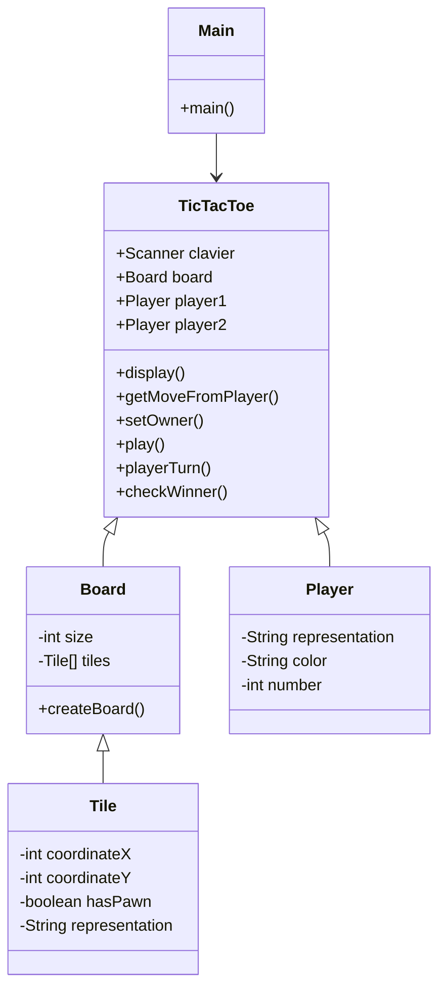

# TicTacToe

School project in Java

---

## Description
This projects aims to create a TicTacToe game, playable in console.

---

## Class diagram

```mermaid
classDiagram
    class Main {
        +main()
    }
    Main --> TicTacToe

    class TicTacToe {
        +Scanner clavier
        +Board board
        +Player player1
        +Player player2
        +display()
        +getMoveFromPlayer()
        +setOwner()
        +play()
        +playerTurn()
        +checkWinner()
    }
    TicTacToe <|-- Board
    TicTacToe <|-- Player

    class Board {
        -int size
        -Tile[] tiles
        +createBoard()
    }
    Board <|-- Tile

    class Tile {
        -int coordinateX
        -int coordinateY
        -boolean hasPawn
        -String representation
    }

    class Player {
        -String representation
        -String color
        -int number
    }
```

