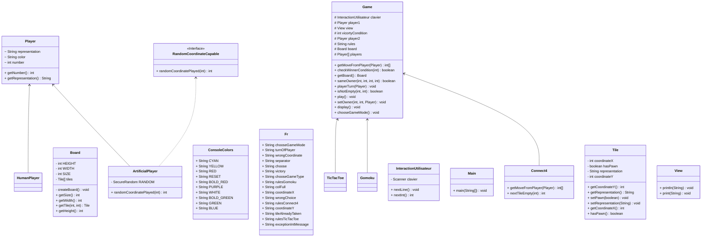
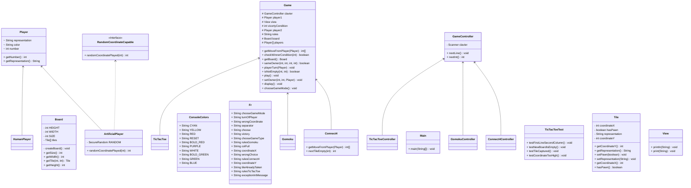
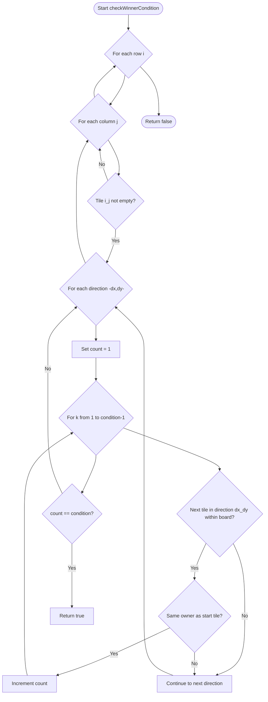

# SquareGames

School project in Java

---

## Description
This project aims to create a TicTacToe game or a Gomoku game, or a Connect4 game, playable in console.

The first menu allows the user to choose the type of game he wants to play, and a second menu allows the user to choose between 3 different game modes :
- human versus human
- human versus computer
- computer versus computer

---

## Prerequisites

To build and run this project, you will need:

- **Java Development Kit (JDK)**: version 17 or higher.
- **Gradle**: the project is compatible with Gradle 8+ and it is recommended to use the **Gradle Wrapper** provided (`./gradlew`).
- **Recommended IDE**: IntelliJ IDEA (or any other Gradle-compatible Java IDE).
- **Internet connection**: required to download dependencies from Maven Central (JUnit 5).

---

### Main Dependencies

- JUnit 5 (`org.junit.jupiter:junit-jupiter`) for unit testing.
- JUnit Platform (`org.junit.platform:junit-platform-launcher`) for test runtime.

---

## Build and Run

To compile and run the project using Gradle:

```bash
# Build the project
./gradlew build

# Run the application
java -cp build/libs/TicTacToe-1.0-SNAPSHOT.jar fr.campus.loic.tictactoe.Main
```

---

## Class diagram before MVC pattern



---  

## Class diagram after MVC pattern



---

## Algorithm for the checkWinnerCondition() method

